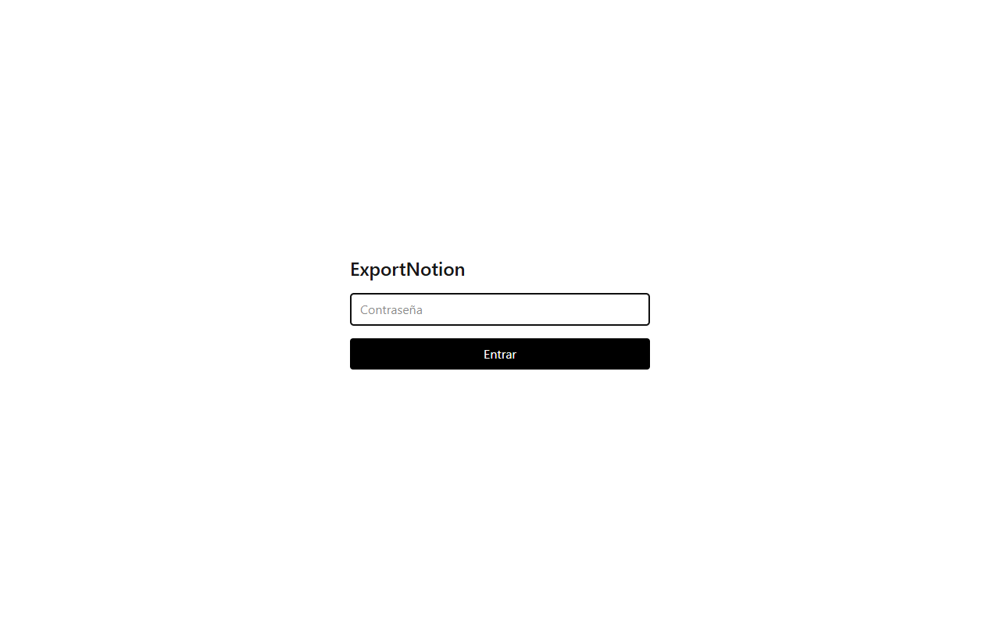
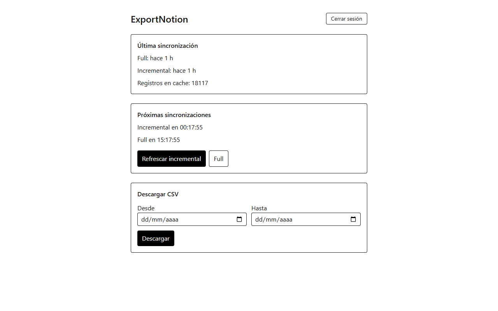
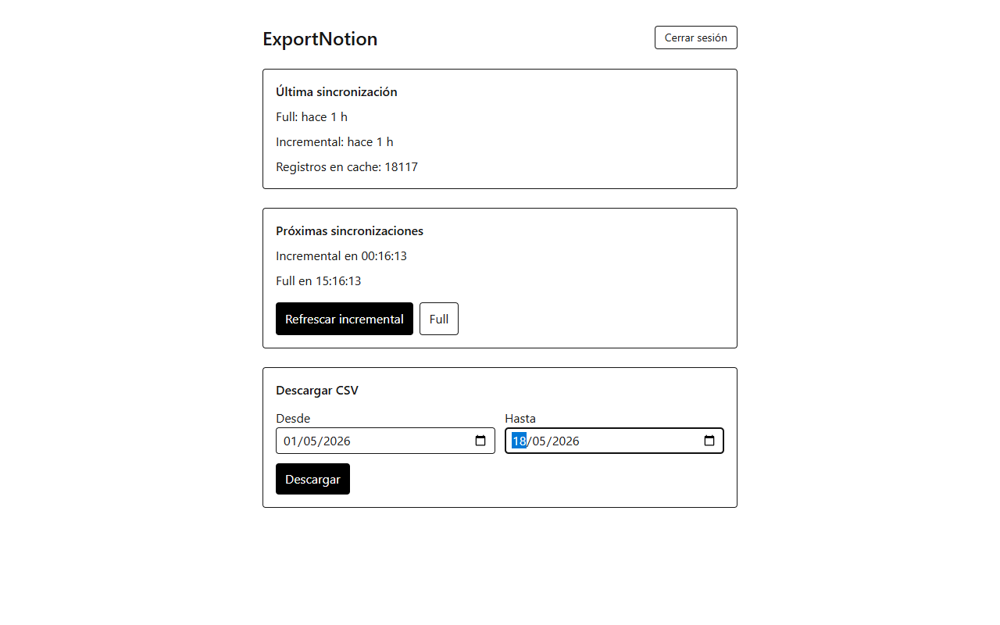
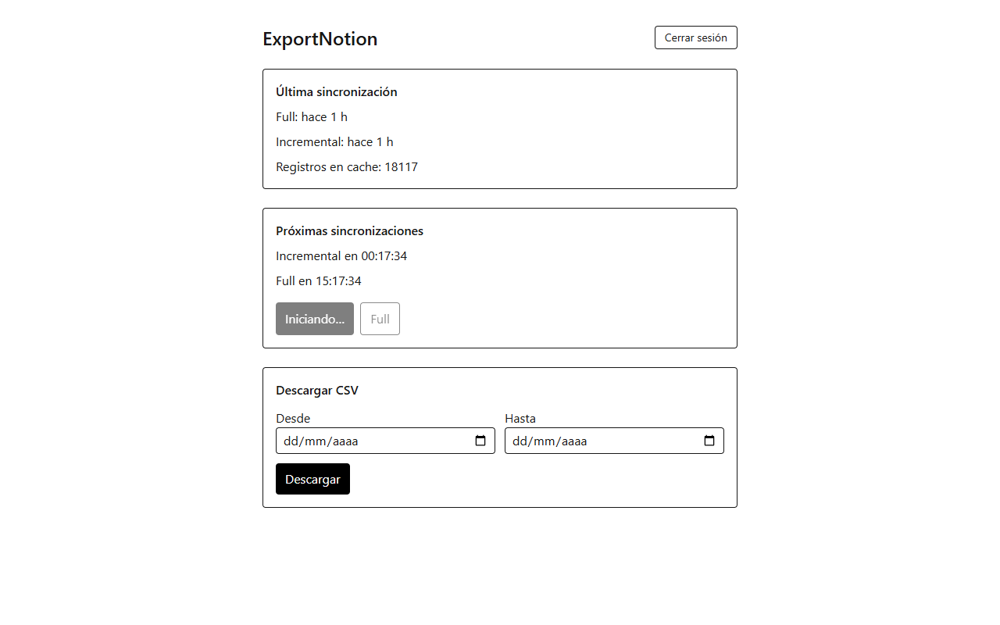
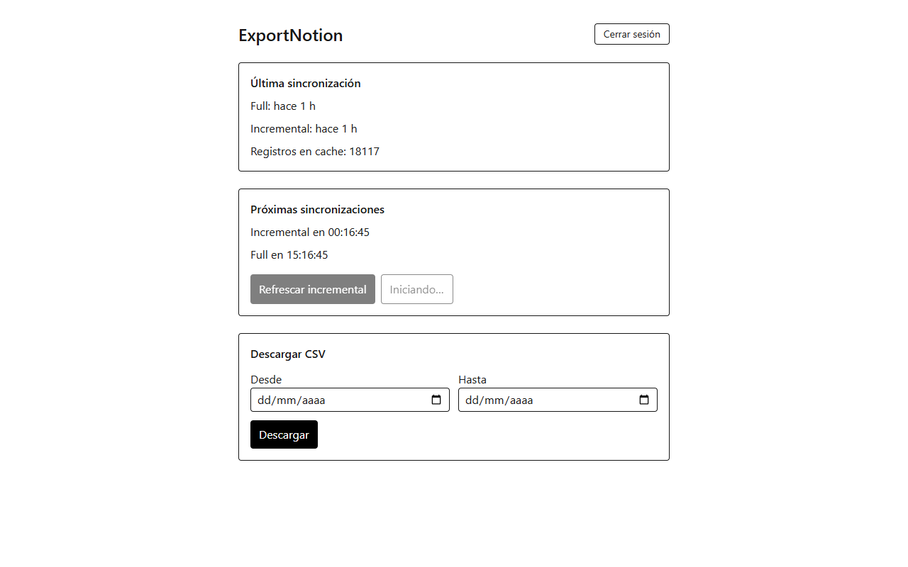

# Manual de usuario — ExportNotion

App pública: **https://iu-exports-notion.vercel.app/**

ExportNotion es una webapp que mantiene una copia diaria de la base de datos `BD Tiempos` de Notion en un cache rápido, y te permite descargar **CSV filtrados por rango de fechas** sin esperar a que Notion responda.

---

## 1. Entrar

Abre **https://iu-exports-notion.vercel.app/**. Vas a ver la pantalla de login:

**Qué hacer:**

1. Escribe la contraseña en el campo "Contraseña".
2. Pulsa **Entrar**. El botón cambia a "Entrando…" mientras valida.

> 💡 La contraseña se la pides al administrador. No hay registro: hay una sola contraseña compartida.

> ⚠️ Si fallas 5 intentos seguidos, la app te bloquea por 15 minutos desde tu IP. Es protección contra ataques de fuerza bruta.

---

## 2. Dashboard

Tras un login correcto verás el panel principal. Las tres secciones son independientes:

### (A) Cabecera

- **"ExportNotion"**: título de la app.
- **Cerrar sesión** (arriba a la derecha): te desloguea. La próxima vez te volverá a pedir contraseña.

### (B) Última sincronización

Resumen del estado del cache:

- **Full: hace X**: cuándo se completó la última sincronización completa (descarga todo desde Notion).
- **Incremental: hace X**: cuándo se completó el último refresco rápido (solo trae lo que cambió).
- **Registros en cache**: cuántas filas hay listas para descargar (en la captura, 18,117).

### (C) Próximas sincronizaciones

- **Incremental en HH:MM:SS**: cuenta regresiva al próximo refresco automático (21:00 UTC todos los días).
- **Full en HH:MM:SS**: cuenta regresiva al próximo full automático (09:00 UTC todos los días).
- **Refrescar incremental**: dispara una sincronización rápida AHORA, sin esperar al cron. Solo trae cambios recientes (~5–15 s).
- **Full**: descarga todo desde Notion ahora (~70 s o más). Úsalo si crees que faltan registros, no si solo quieres lo último.

### (D) Descargar CSV

- **Desde / Hasta**: rango opcional de fechas. El filtro es por la columna `Hora de creación`. Si dejas ambos vacíos, descargas TODO el cache.
- **Descargar**: genera y baja el CSV con el nombre `export-<desde>-<hasta>-<timestamp>.csv`.

---

## 3. Descargar un CSV

### Sin filtro (todo)

1. Asegúrate de que **Registros en cache** sea mayor a 0.
2. Deja los campos **Desde** y **Hasta** vacíos.
3. Pulsa **Descargar**. El botón cambia a "Descargando…" mientras el server prepara el archivo. Cuando termina, el navegador inicia la descarga automática.

### Con rango de fechas

1. Pon una fecha en **Desde** (ej. `2026-05-01`). Solo se incluirán registros creados en o después de esa fecha.
2. Pon una fecha en **Hasta** (ej. `2026-05-18`). Solo se incluirán registros creados en o antes de esa fecha.
3. Puedes dejar uno de los dos vacío:
   - Solo **Desde** = "desde esa fecha hasta hoy".
   - Solo **Hasta** = "desde el principio hasta esa fecha".
4. Pulsa **Descargar**.

**Formato del CSV:**

- Encoding: UTF-8.
- Una fila por registro de Notion.
- Columnas (21 en este orden): `Breve descripción`, `Empresa productiva`, `Hecho por`, `Hecho por (no tocar)`, `Hito`, `Hito (no tocar)`, `Hora de creación`, `Hora de finalización`, `Hora de última edición`, `ID`, `Persona`, `Proyecto`, `Proyecto (no tocar)`, `Registro de horas`, `Subproyecto`, `Subproyecto (Nombre)`, `Subproyecto (no tocar)`, `Tarea`, `Tarea (no tocar)`, `Último editor`, `Validación`.
- Orden de filas: **ascendente por `Hora de creación`** (las más viejas primero).

---

## 4. Sincronizar manualmente

Aunque la app sincroniza sola dos veces al día, a veces necesitas refrescar al momento.

### Incremental (rápido)

Úsalo cuando:

- Acabas de editar algo en Notion y quieres verlo reflejado ya.
- No estás seguro de si los cambios recientes están en el cache.

**Cómo:**

1. Pulsa **Refrescar incremental**.
2. El botón cambia a "Iniciando…" mientras arranca:

   

3. Recarga la página después de 10–20 segundos para ver el `Registros en cache` y el `Incremental: hace X` actualizados.

### Full (completo)

Úsalo cuando:

- El número de **Registros en cache** parece más bajo de lo esperado.
- Borraste/archivaste muchos registros en Notion y no se reflejan.
- Hubo un cron fallido (revisa con el admin si hay dudas).

**Cómo:**

1. Pulsa **Full**.
2. El botón cambia a "Iniciando…":

   

3. Espera entre **1 y 3 minutos**. Recarga la página para ver el progreso.
4. Cuando termine, **Registros en cache** se actualiza y **Full: hace X** marca el nuevo timestamp.

> ⚠️ Mientras un sync está corriendo, ambos botones (Incremental y Full) están deshabilitados. No puedes lanzar dos a la vez.

---

## 5. Cancelar un sync en curso

Si un Full está corriendo y necesitas detenerlo sin perder lo que ya descargó, aparece un botón **Cancelar y guardar lo cargado** mientras está activo.

**Cómo:**

1. Mientras veas "Sync en progreso" en la UI, pulsa **Cancelar y guardar lo cargado**.
2. El sync corta en el siguiente punto seguro y guarda en el cache **solo lo que alcanzó a descargar** (ej. 8,000 de 18,000).
3. El próximo Full (manual o programado) repondrá el faltante.

> ⚠️ Después de cancelar, el `Registros en cache` puede bajar temporalmente. No es bug — es lo que pediste.

---

## 6. Cerrar sesión

Pulsa el botón **Cerrar sesión** (arriba a la derecha). El botón muestra "Saliendo…" mientras procesa y luego te regresa a la pantalla de login.

> 💡 Cerrar sesión es opcional — la cookie de sesión expira sola tras un tiempo de inactividad. Úsalo si compartes la computadora.

---

## 7. Problemas comunes

| Síntoma | Causa probable | Qué hacer |
|---|---|---|
| "Contraseña incorrecta" tras intentos válidos | Demasiados intentos: estás rate-limited (5 / 15 min por IP) | Esperar 15 minutos o pedir al admin que limpie el rate-limit en Upstash |
| Botón Descargar → "Error 503: Aún no hay datos. Corre el primer sync." | Cache vacío | Pulsa **Full** y espera ~2 min |
| `Registros en cache: 0` justo después de cancelar un sync | Cancelaste antes de que se descargara la primera página | Vuelve a disparar **Full** y déjalo correr |
| Descarga vacía con un rango de fechas | No hay registros en ese rango | Quita las fechas o amplía el rango |
| Las cuentas regresivas no avanzan | La app no está cargando estado | Refresca la página (F5) |
| El sync se queda "trabado" mucho tiempo | Vercel cortó la función (timeout) | Espera 10 minutos a que se libere el lock, luego vuelve a disparar |

Si nada de lo anterior funciona, contacta al administrador con un screenshot del problema.

---

## 8. Calendario de sincronizaciones automáticas

| Tipo | Horario UTC | Horario CDMX (UTC−6) | Qué hace |
|---|---|---|---|
| Full | 09:00 | 03:00 | Reemplaza completamente el cache con lo que hay en Notion |
| Incremental | 21:00 | 15:00 | Solo trae los registros modificados desde el último sync |

Estos crons corren solos en Vercel; no necesitas hacer nada para que se ejecuten.
